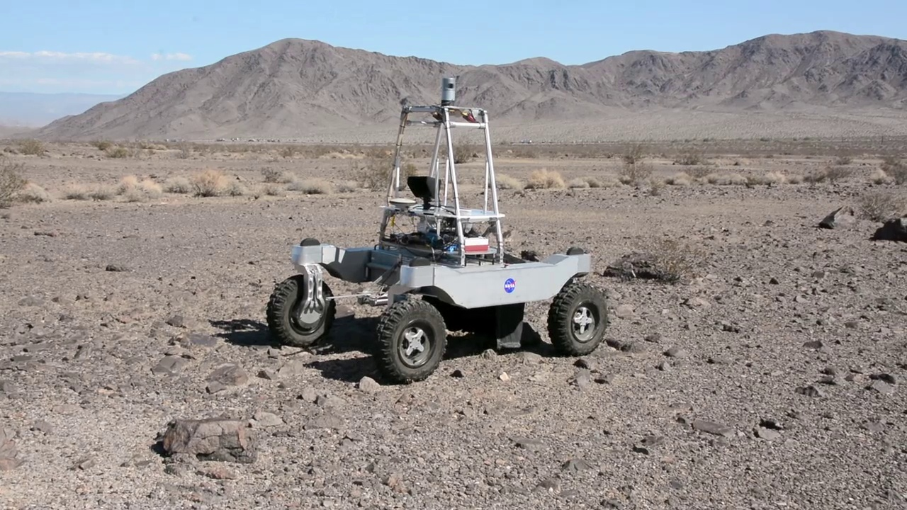

# Dataset-from-Video-w-OpenCV
Creating dataset from video with OpenCV

# How to use

Run `video.py` to play desired video. To change the video source, change the `cap = cv2.VideoCapture('videoplayback.mp4')`.
For default webcam input use `cv2.VideoCapture(0)`. Change `0` to `1` and so on for additional cams. 

# Example
From the `Rover Searches California Desert for Water to Simulate Future Lunar Missions` (https://www.nasa.gov/downloadable/videos/arc-aav2718-krex-mvp2015-nasaweb.mp4) video, we would like to create a dataset of rover.

* 1. First, create label. I named it `rover`.
* 2. Then, when the video is playing, press `s` to save frame into image. To stop playing video, press `q`.

# Advances
To create object detection dataset (in example Pascal VOC or YOLO format), put the produced images into a folder, then using LabelImg (`https://github.com/tzutalin/labelImg`), you could create bounding box(es). 

